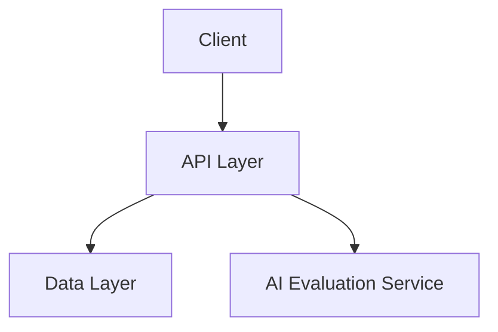

# Architecture Overview

This document provides a detailed explanation of the architecture for the AI Interview Backend.

## Overview

The AI Interview Backend is designed with scalability, maintainability, and performance in mind. It follows a modular architecture to ensure that each component is independent and can be developed, tested, and deployed separately.

## System Architecture Diagram

Below is a high-level architecture diagram showing the interaction between the API Layer, Data Layer, and AI Evaluation Service:

## Components

### 1. API Layer

- **Responsibility**: Handles HTTP requests and responses, contains request processing logic.
- **Technology**: Built using Go (Golang) with RESTful API principles.
- **Endpoints**: Defined in the `openapi.yaml` file.
- **Logic**: Contains interview processing, evaluation logic, and AI service coordination.

### 2. Data Layer

- **Responsibility**: Manages data persistence and retrieval.
- **Database**: Uses PostgreSQL for storing interview records, questions, and evaluation results.
- **ORM/Driver**: Uses `gorm` for database interaction with hybrid store pattern.
- **Flexibility**: Supports both in-memory and database backends for development and production.

### 3. AI Evaluation Service

- **Responsibility**: Processes interview answers and generates feedback using AI models.
- **Integration**: Communicates with external AI services or in-house models.

## Data Flow

1. **Request Handling**: The API Layer receives HTTP requests from the client and validates them.
2. **Request Processing**: The API handlers process the request, applying business logic directly within the handlers.
3. **Data Interaction**: The API Layer interacts with the Data Layer (via Hybrid Store) to retrieve or store information.
4. **AI Evaluation**: If required, the API Layer communicates with the AI Evaluation Service to process interview answers and generate feedback.
5. **Response Generation**: The processed data is formatted and returned as an HTTP response to the client.

## Database Design

The database is designed to store interview records, questions, and answers. Below is a simplified schema:

- **interviews**:
  - `id` (UUID): Unique identifier for the interview.
  - `created_at` (TIMESTAMP): Timestamp of when the interview was created.

- **interview_logs**:
  - `id` (SERIAL): Unique identifier for the log entry.
  - `interview_id` (UUID): Foreign key referencing `interviews`.
  - `question` (TEXT): The question asked during the interview.
  - `answer` (TEXT): The answer provided by the interviewee.
  - `created_at` (TIMESTAMP): Timestamp of when the log entry was created.

## Technology Stack

- **Backend Language**: Go (Golang)
- **Database**: PostgreSQL
- **API Documentation**: OpenAPI (defined in `openapi.yaml`)

## Folder Structure

- `api/`: Contains API route definitions, handlers, and request processing logic.
- `data/`: Contains database models, data access logic, and hybrid store implementation.
- `ai/`: Contains logic for interacting with AI models and evaluation services.
- `config/`: Contains application configuration and environment handling.
- `docs/`: Contains documentation, including the `openapi.yaml` file.

## Future Enhancements

- Add WebSocket support for real-time updates.
- Implement caching for frequently accessed data.
- Introduce monitoring and logging for better observability.
